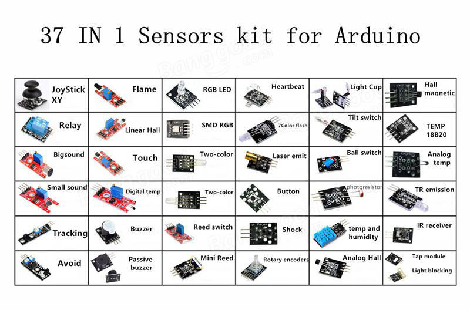

# Kit 37 Sensores

**IMPORTANTE**

Las señales de GND, VCC y señal de cada módulo están en muchas ocasiones mal representadas en la PCB. **como norma general ignora los iconos del PCB y fijate en las soldaduras- La soldadura cuadrada será generalmente la señal, el pin central VCC y el opuesto a la soldadura cuadrada GND**

[Kit comprado en Banggood por 7,5$](https://www.banggood.com/Geekcreit-37-In-1-Sensor-Module-Board-Set-Kit-For-Arduino-p-1137051.html)

[documentación y librerías](http://files.banggood.com/2016/06/37-in-1-SENSORS-KIT.rar)

### Componentes

Active buzzer

Passive buzzer

Common cathode RED&GREEN LED

Two color common cathode LED

Knock sensor

Shock switch sensor

Photo resistor sensor

Push button

Tilt switch

[RGB LED](./ejemplos/ledrgb/ledrgb.ino)

Infrared transmit

RGB colorful LED

Hydrargyrum switch sensor

Colorful auto flash

Magnet-ring sensor

Hall sensor

Infrared receive sensor

Analogy hall sensor

Magic ring

[Rotate encode](./ejemplos/Encoder/Encoder.ino)

Light break sensor

Finger pulse sensor

Magnetic spring

Obstacle avoidance sensor

Tracking sensor

Microphone sensor

[Laser transmit](./ejemplos/laser/laser.ino)

[Relay](./ejemplos/rele/rele.ino)

Analog temperature sensor

18b20 temperature sensor

Digital temperature sensor

Linear hall Sensor

Flame sensor

High sensitive voice sensor

Humidity sensor

Joystick PS2

Touch sensor

